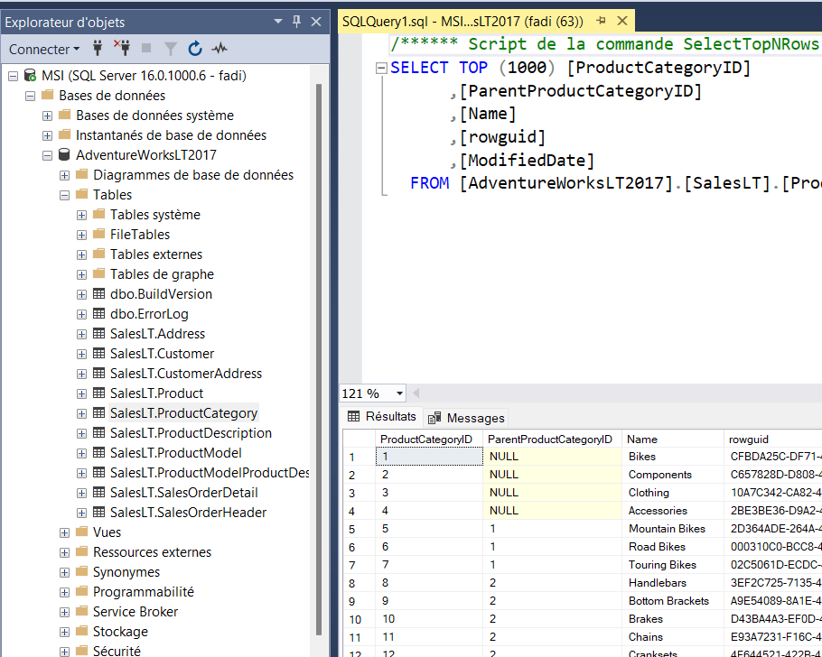
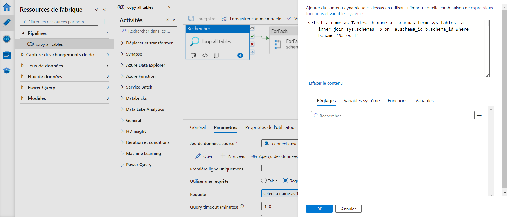
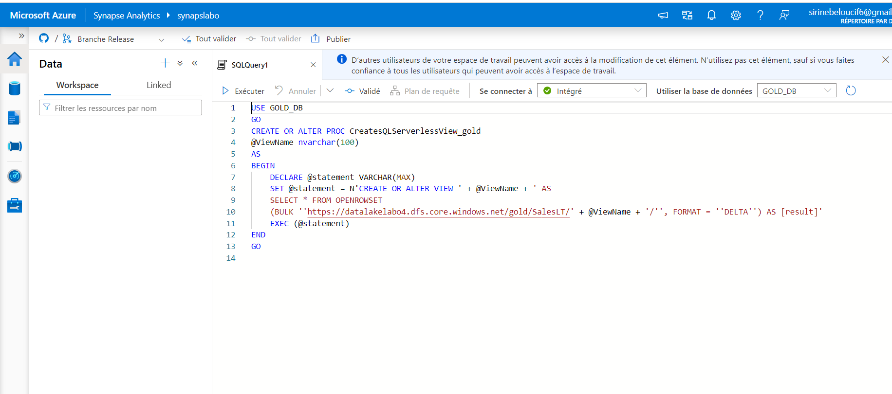
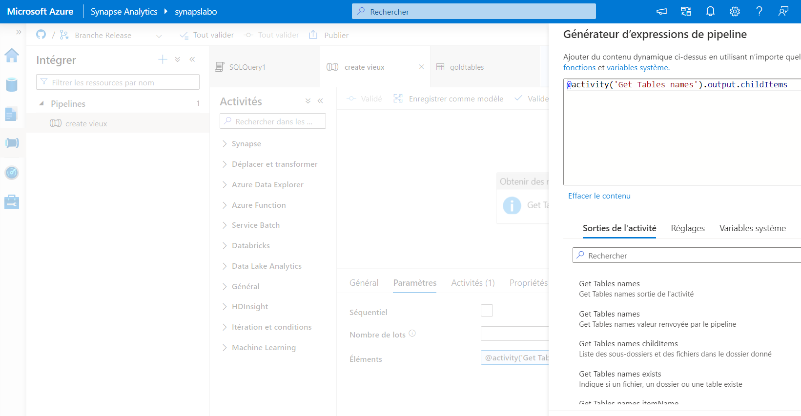
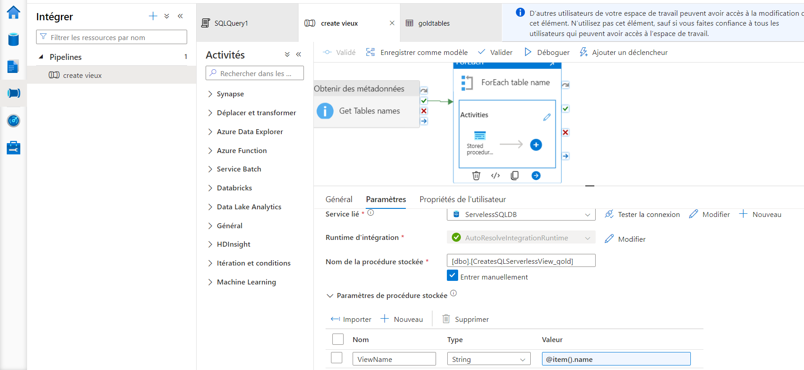
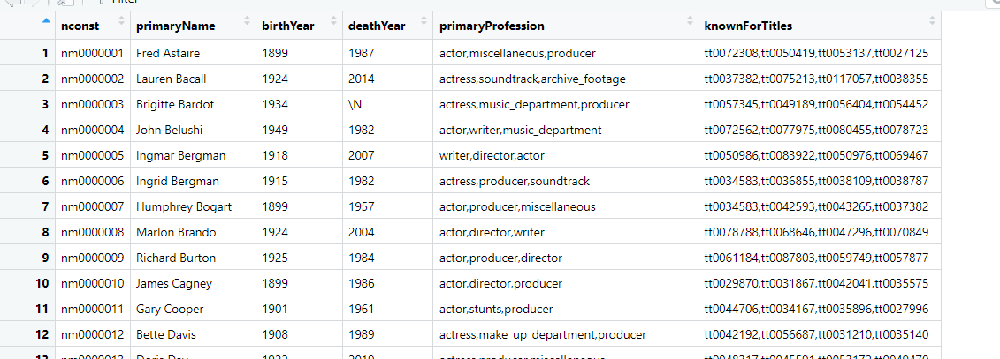
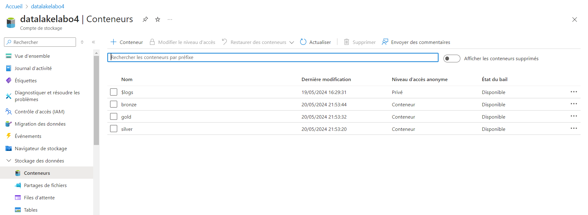

# Pipeline de Données de Bout en Bout sur Azure 

## Vue d'Ensemble

Ce document présente une solution complète d'ingénierie des données sur Azure. Ce projet intègre divers services Azure pour orchestrer, transformer et visualiser les données. La pipeline utilise :  

- **Azure Data Factory (ADF)** pour l'orchestration des données  
- **Azure Databricks** pour la transformation des données avec des notebooks PySpark  
- **Azure Synapse Analytics** pour l'entreposage des données  
- **Power BI** pour la visualisation  

---

## Structure du Projet
Le projet est organisé autour des composants suivants :  

- **Key Vault** : Gestion des secrets pour éviter le stockage d'informations sensibles dans le code  
- **Azure Storage Account** : Stockage cloud évolutif et durable  
- **Azure Data Factory (ADF)** : Orchestration des flux de données et exécution des notebooks Databricks  
- **Azure Databricks** : Traitement des données (bronze → silver → gold)  
- **Azure Synapse Analytics** : Entrepôt de données  
- **Power BI** : Visualisation interactive des données  

---

## Prérequis
Avant de commencer, assurez-vous d'avoir :  

- Un abonnement Azure avec les permissions nécessaires  
- Accès à Azure Data Factory, Azure Databricks, Azure Synapse Analytics et Power BI  
- Une compréhension de base des services Azure et des concepts d'ingénierie des données  

---
## Mise en Place du Projet

**1. Téléchargement et Restauration de la Base de Données AdventureWorksLT2017**  
- **Télécharger la base de données** : Obtenez AdventureWorksLT2017 depuis le lien officiel  
- **Restaurer la base de données** : Suivez les instructions pour restaurer la base sur votre instance SQL Server  

**2. Configuration d'Azure Data Factory (ADF)**  
Azure Data Factory orchestre le mouvement des données et l'exécution des transformations.  

- **Accéder à ADF Studio**  
  - Se rendre sur le portail Azure et ouvrir ADF  
  - Cliquer sur "Author & Monitor"  

- **Créer un pipeline**  
  - Aller dans "Author" et cliquer sur "New pipeline"  
  - Nommer le pipeline de manière significative  

- **Ajouter et configurer des activités**  
  - Ajouter des activités comme "Copy Data", "Data Flow" et "Lookup"  
  - Définir les sources et destinations  

- **Configuration des Sources de Données**  
  - **Services liés** : Aller dans "Manage" > "Linked services"  
  - Ajouter des connexions (Azure SQL, Blob Storage, etc.)  
  - **Jeux de données** : Définir les datasets source et destination  
  - Configurer les mappings de schéma  

- **Intégration avec Azure Databricks**  
  - Créer des notebooks Databricks pour la transformation bronze → silver → gold  
  - Ajouter l'activité Databricks Notebook au pipeline  
  - Configurer des exécutions planifiées ou événementielles  
  - Surveiller les exécutions via l'onglet "Monitor"  

---

**3. Configuration d'Azure Databricks**  

Azure Databricks offre un environnement Spark pour le traitement des données.  

- **Créer un Espace de Travail**  
  - Créer un workspace dans Azure Portal  
  - Configurer les paramètres (région, tarification)  

- **Créer et Configurer un Cluster**  
  - Définir la taille des VM, le nombre de nœuds et la version Spark  
  - Configurer l'auto-scaling  

- **Développement de Notebooks Python**  
  - Créer des notebooks et écrire le code pour les transformations bronze → silver → gold  
  - Exécuter et valider le code  

---

**4. Configuration d'Azure Synapse Analytics**  

Azure Synapse combine big data et entreposage de données.  

- **Créer un Espace de Travail Synapse**  
  - Créer un workspace dans le portail Azure  
  - Configurer les connexions aux sources de données  

- **Configuration des Pools SQL**  
  - Créer des pools SQL dédiés ou serverless  
  - Ajuster les performances  
  - Exécuter des requêtes SQL  
  - Créer des vues standards  

---

**5. Configuration de Power BI**  

Power BI permet la visualisation interactive des données.  

- **Connexion à Azure Synapse**  
  - Importer les données dans Power BI Desktop  
  - Créer des modèles de données  

- **Création de Rapports Interactifs**  
  - Concevoir des rapports avec visualisations  
  - Ajouter des graphiques et tableaux de bord  

- **Publication et Partage**  
  - Publier sur Power BI Service  
  - Partager les rapports avec les parties prenantes  

---

## conclusion
Ce document fournit un guide détaillé pour mettre en place un pipeline de données sur Azure. En intégrant ADF, Databricks, Synapse et Power BI, il permet une gestion efficace des données et une visualisation performante.  
